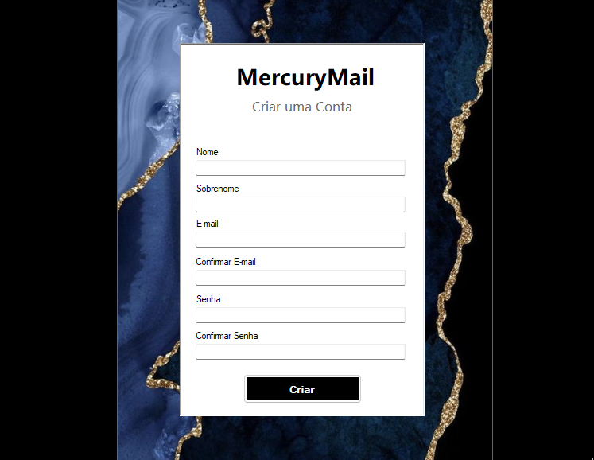
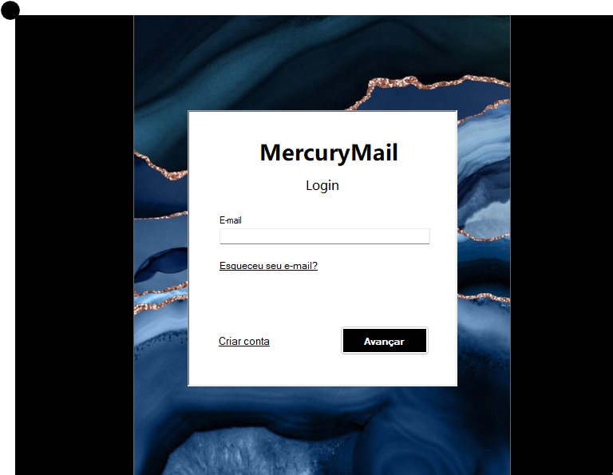
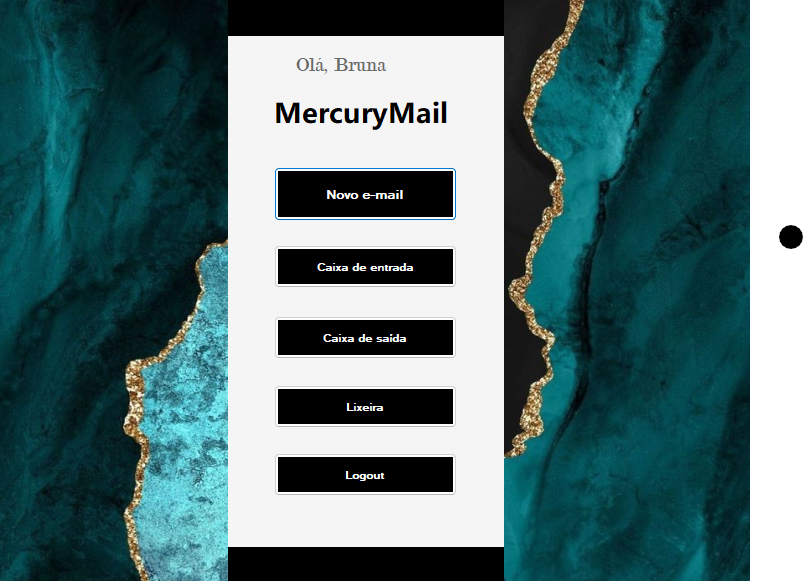
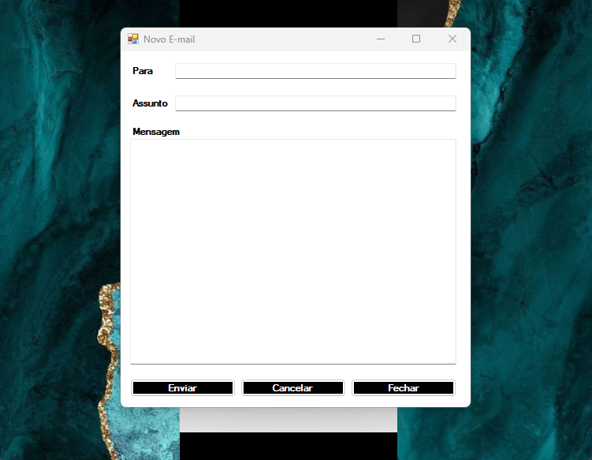
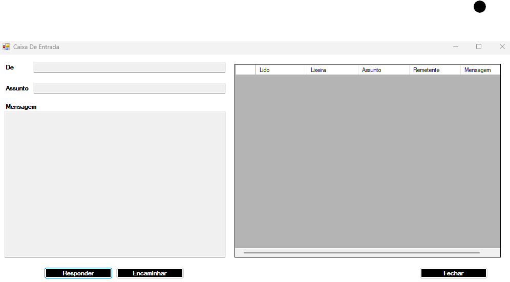
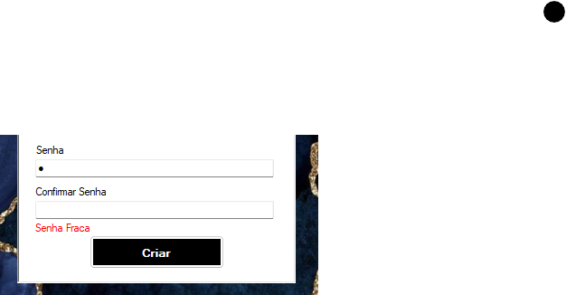
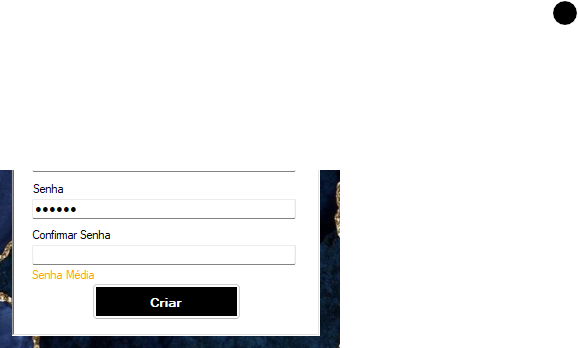
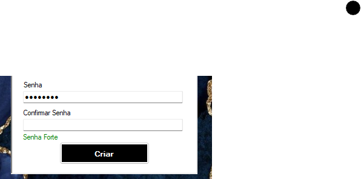

# Projeto Mercury - Webmail

O Projeto Mercury é uma aplicação de webmail desenvolvida em C# utilizando Windows Forms. A aplicação oferece uma interface intuitiva e eficiente para gerenciar e-mails, proporcionando uma experiência de usuário simplificada.

# Principais Recursos

Caixa de Entrada: Visualizar e gerenciar os e-mails de forma organizada  
Caixa de Saída: Acompanhar os e-mails enviados e seu status  
Lixeira: Recuperar ou excluir e-mails da lixeira  
Segurança: Criptografia de senha para garantir a proteção dos dados do usuário (Hash SHA-256)  
Interface Amigável: Design moderno e intuitivo para facilitar a navegação  
O Banco de Dados e as respectivas tabelas são criadas automaticamente assim que o programa é inicializado  

# Tecnologias Utilizadas

C#: Linguagem de programação principal  
SQL Server: Banco de dados relacional para armazenamento de dados 
WinForms: Interface gráfica para o aplicativo de gerenciamento 

A documentação completa pode ser acessada no arquivo "Documentação MercuryMail.docx"

