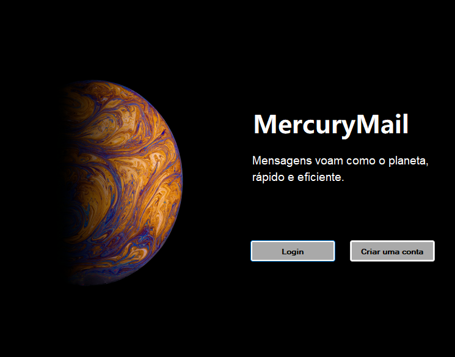

# Projeto Mercury - Webmail

O Projeto Mercury é uma aplicação de webmail desenvolvida em C# utilizando o framework .NET. A aplicação oferece uma interface intuitiva e eficiente para gerenciar e-mails, proporcionando uma experiência de usuário simplificada.

# Principais Recursos

Caixa de Entrada: Visualize e gerencie seus e-mails de forma organizada.  
Caixa de Saída: Acompanhe os e-mails enviados e seu status.  
Lixeira: Recupere ou exclua e-mails da lixeira.  
Segurança: Criptografia de senha para garantir a proteção dos dados do usuário.  
Interface Amigável: Design moderno e intuitivo para facilitar a navegação.  

# Tecnologias Utilizadas

C#: Linguagem de programação principal.  
ASP.NET: Utilizado para construir a aplicação web. 
SQL Server: Banco de dados relacional para armazenamento de dados. 
WinForms: Interface gráfica para o aplicativo de gerenciamento. 
